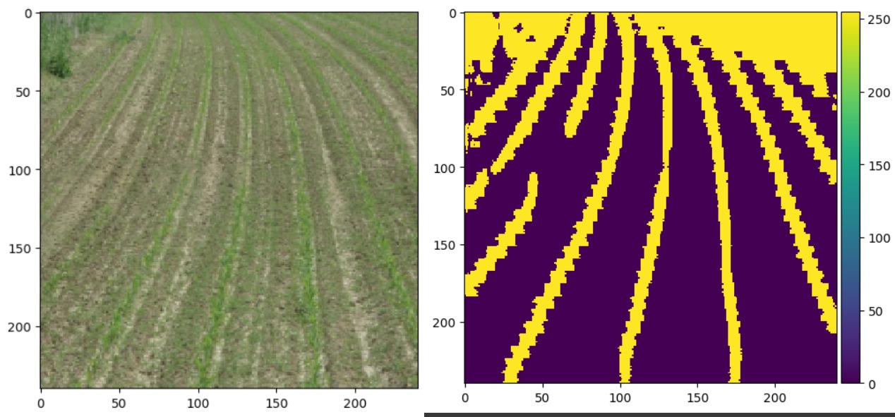

 #  FireNet-UNet: Lightweight Deep Learning for Crop Row Detection

This project presents **FireNet-UNet**, a lightweight and efficient image segmentation model tailored for **automated crop row detection** in agricultural fields. Built on the foundational U-Net architecture, this model integrates **Fire Modules** (from SqueezeNet) to reduce model size while maintaining high accuracy—making it ideal for real-time or edge deployment on resource-constrained devices like drones and robots.

---

##  Why Crop Row Detection?

Accurate detection of crop rows is crucial for:

-  Autonomous agricultural vehicles (e.g., tractors, drones, robots)  
-  Precision weeding and spraying  
-  Yield prediction and monitoring  
-  Efficient resource allocation (water, fertilizers)  

**FireNet-UNet** processes aerial or ground-level field images to segment and highlight structured crop rows, enabling downstream tasks like navigation and field mapping.

---

##  Key Features

-  **Custom Encoder-Decoder** with Fire Modules for reduced parameters and computation  
-  **Transposed Fire Modules** for efficient upsampling  
-  **Skip Connections** to retain fine spatial details  
-  **Binary Segmentation** output with sigmoid activation (crop row vs background)  
-  Trained and evaluated on custom annotated datasets of crop fields  

---

##  Technologies Used

-  TensorFlow / Keras  
-  Python   
-  Custom preprocessing and data augmentation  
-  Evaluation with **IoU** and **Dice Score**  

---

##  Results

-  High segmentation accuracy even under challenging lighting and occlusion  
-  Robust to noise, gaps in rows, and varying crop types  
-  Suitable for real-time inference on lightweight hardware  

---

Sample Output

Below is a sample prediction from the FireNet-UNet model showing segmented crop rows:

  

---

